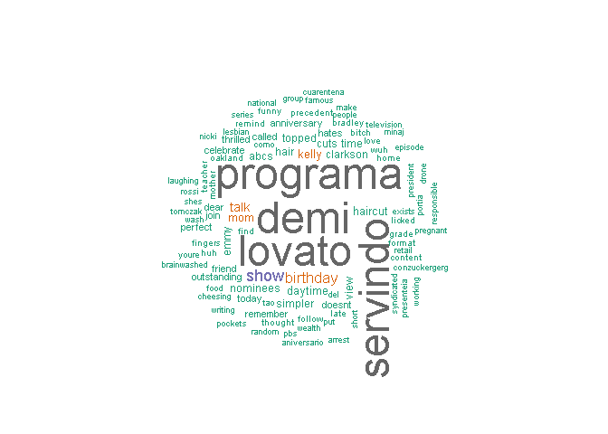
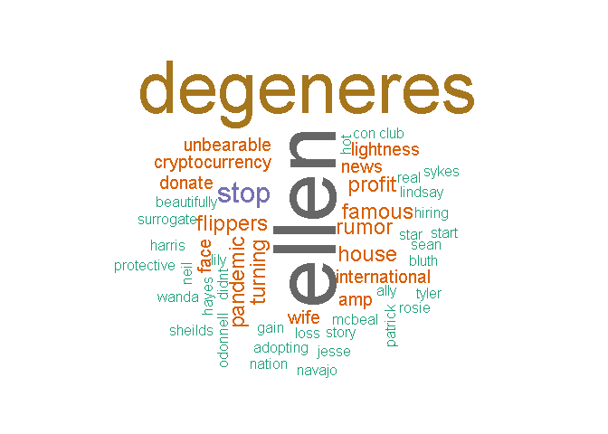
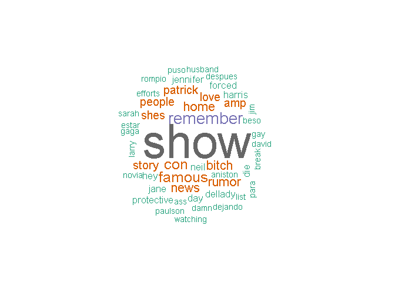

**Coleta, Limpeza e Transformação - Termos de pesquisa**
================

Para isso, usarei a função:

  - ellen\_tweets = searchTwitter(“Ellen DeGeneres”, n = 300, lang =
    NULL)
  - portia\_tweets = searchTwitter(“portia de rossi”, n = 300, lang =
    NULL)

# **Coleta**

## **Fontes de funções e autenticação**

``` r
source('01-Twitter/01-Coleta_limpeza_transformação/utils.R')
source('01-Twitter/01-Coleta_limpeza_transformação/autentication.R')
## [1] "Using direct authentication"
```

## **Pacotes**

``` r
library(devtools)
library(twitteR)
library(ROAuth)
library(tm)
library(wordcloud)
library(RColorBrewer)
library(stringr)
library(stopwords)
```

## **Coletando os tweets - searchTwitter()**

``` r
ellen_tweets = searchTwitter("Ellen DeGeneres", n = 300, lang = NULL)
portia_tweets = searchTwitter("portia de rossi", n = 300, lang = NULL)
```

  - lan: Eu poderia especificar um tipo de lingua como “pt”, “en”
  - until: ao invés de especificar um “n”, eu poderia especificar uma
    data
  - maxID/sinceID: Retorna tweets antigos ou mais recentes

## **Visualizando**

Os tweets coletados estão armazenados em uma lista

``` r
head(ellen_tweets,3)
## [[1]]
## [1] "treactor_art: looked up some aquarius celebrities and had the grim reminder that ellen  degeneres and i share birthdays"
## 
## [[2]]
## [1] "IamJuanse: RT @YourFriendKevin: It's no longer about being gay or straight, republican or democrat. What will tear us apart is how those with wealth t…"
## 
## [[3]]
## [1] "ThatTechWebsite: Ellen DeGeneres cuts mum’s hair for 90th birthday and she ‘hates how it looks’ https://t.co/wBmlJg49RH"
head(portia_tweets,3)
## [[1]]
## [1] "funniesttoehoe: @wtchysapphic Lily Tomlin\nJane Fonda\nMichelle Gomez\nMiranda Otto\nPortia De Rossi\nLily Rabe\nSarah Paulson\nLady Gaga… https://t.co/XsHXHKk6sc"
## 
## [[2]]
## [1] "cici_n_bey: OMG ITS PORTIA DE ROSSI !!! PORTIA IS ON ! ITS PORTIA"
## 
## [[3]]
## [1] "ayvalikereviz: portia de rossi anam saksuka yapmis pwvmgwövgwlvprpr"
class(ellen_tweets)
## [1] "list"
```

## **Convertendo os tweets para texto - x$getText()**

``` r
textos_ellen = sapply(ellen_tweets, function(x) x$getText())
head(ellen_tweets,3)
## [[1]]
## [1] "treactor_art: looked up some aquarius celebrities and had the grim reminder that ellen  degeneres and i share birthdays"
## 
## [[2]]
## [1] "IamJuanse: RT @YourFriendKevin: It's no longer about being gay or straight, republican or democrat. What will tear us apart is how those with wealth t…"
## 
## [[3]]
## [1] "ThatTechWebsite: Ellen DeGeneres cuts mum’s hair for 90th birthday and she ‘hates how it looks’ https://t.co/wBmlJg49RH"
textos_portia = sapply(portia_tweets, function(x) x$getText())
textos_ellen[1:5]
## [1] "looked up some aquarius celebrities and had the grim reminder that ellen  degeneres and i share birthdays"                                   
## [2] "RT @YourFriendKevin: It's no longer about being gay or straight, republican or democrat. What will tear us apart is how those with wealth t…"
## [3] "Ellen DeGeneres cuts mum’s hair for 90th birthday and she ‘hates how it looks’ https://t.co/wBmlJg49RH"                                      
## [4] "RT @MirrorCeleb: Ellen DeGeneres cuts mother's hair for her 90th birthday and she 'hates it'\nhttps://t.co/5I08V1ZYf1"                       
## [5] "RT @people: Ellen DeGeneres Gives Her Mom a Haircut for her 90th Birthday and She Doesn’t Like It — Yet https://t.co/sdT7zALl2O"
class(textos_ellen)
## [1] "character"
```

# **Limpeza**

## **Limpeza dos tweets - limpaTweets()**

A função limpaTweets foi criada e está no diretório utils. O que ele
faz: - Remove http links - Remove retweets - Remove “\#Hashtag” - Remove
nomes de usuarios “@people” - Remove pontuacão - Remove os números -
Remove espacos desnecessários - Converte encoding de caracteres -
Converte para letra minúscula

Ainda fazermos a Remoção de tweets em branco (quando tem só imagem no
tweet):

``` r
textos_ellen_limpo = textos_ellen
textos_ellen_limpo = limpaTweets(textos_ellen_limpo)
head(textos_ellen_limpo)
## [1] "looked up some aquarius celebrities and had the grim reminder that ellen degeneres and i share birthdays"            
## [2] "s no longer about being gay or straight republican or democrat what will tear us apart is how those with wealth t..."
## [3] "ellen degeneres cuts mum's hair for th birthday and she 'hates how it looks'"                                        
## [4] "ellen degeneres cuts s hair for her th birthday and she hates"                                                       
## [5] "ellen degeneres gives her mom a haircut for her th birthday and she doesn't like it - yet"                           
## [6] "ellen degeneres gives her mom a haircut for her th birthday and she doesn't like it - yet"
names(textos_ellen_limpo) = NULL
textos_ellen_limpo = textos_ellen_limpo[textos_ellen_limpo != ""]
textos_ellen_limpo[1:2]
## [1] "looked up some aquarius celebrities and had the grim reminder that ellen degeneres and i share birthdays"            
## [2] "s no longer about being gay or straight republican or democrat what will tear us apart is how those with wealth t..."
class(textos_ellen_limpo)
## [1] "character"
```

``` r
textos_portia_limpo = textos_portia
textos_portia_limpo = limpaTweets(textos_portia_limpo)
names(textos_portia_limpo) = NULL
textos_portia_limpo = textos_portia_limpo[textos_portia_limpo != ""]
textos_portia_limpo[1:5]
## [1] "lily tomlin\njane fonda\nmichelle gomez\nmiranda otto\nportia de rossi\nlily rabe\nsarah paulson\nlady gaga..."
## [2] "omg its portia de rossi portia is on its portia"                                                               
## [3] "portia de rossi anam saksuka yapmis pwvmgwovgwlvprpr"                                                          
## [4] "portia de rossi dejando a ellen degeneres despues del beso de jennifer aniston rumor"                          
## [5] "maybe portia de rossi"
```

## **Converte para Corpus e limpa - limpaCopus()**

Convertemos os characters para VectorSource e depois para Corpus. Depois
utilizamos a função limpaCorpus que:

  - Remove pontuação
  - Remove números

<!-- end list -->

``` r
tweetcorpus_ellen = Corpus(VectorSource(textos_ellen_limpo))
tweetcorpus_ellen = limpaCorpus(tweetcorpus_ellen)
tweetcorpus_portia = Corpus(VectorSource(textos_portia_limpo))
tweetcorpus_portia = limpaCorpus(tweetcorpus_portia)
class(VectorSource(textos_ellen_limpo))
## [1] "VectorSource" "SimpleSource" "Source"
```

## **Remover stopwords e outras palavras**

``` r
tweetcorpus_ellen = tm_map(tweetcorpus_ellen, removeWords, c(stopwords("SMART")))
tweetcorpus_ellen = tm_map(tweetcorpus_ellen, removeWords, c("degeneres"))
tweetcorpus_ellen = tm_map(tweetcorpus_ellen, stripWhitespace)
tweetcorpus_portia = tm_map(tweetcorpus_portia, removeWords, c(stopwords("SMART")))
tweetcorpus_portia = tm_map(tweetcorpus_portia, removeWords, c("portia","de", "rossi"))
tweetcorpus_portia = tm_map(tweetcorpus_portia, stripWhitespace)
```

# **Texto para a matriz de termos - as.matrix(TermDocumentMatrix())**

Ao transformar em matrix, já retiramos também as stopwords.

``` r
termo_por_documento_ellen = as.matrix(TermDocumentMatrix(tweetcorpus_ellen))
termo_por_documento_portia = as.matrix(TermDocumentMatrix(tweetcorpus_portia))
```

Verifica os primeiros 10 termos (linhas) com os primeiros 10 documentos
(colunas)

``` r
termo_por_documento_ellen[1:10,1:10]
##              Docs
## Terms         1 2 3 4 5 6 7 8 9 10
##   aquarius    1 0 0 0 0 0 0 0 0  0
##   birthdays   1 0 0 0 0 0 0 0 0  0
##   celebrities 1 0 0 0 0 0 0 0 0  0
##   ellen       1 0 1 1 1 1 1 1 1  1
##   grim        1 0 0 0 0 0 0 0 0  0
##   looked      1 0 0 0 0 0 0 0 0  0
##   reminder    1 0 0 0 0 0 0 0 0  0
##   share       1 0 0 0 0 0 0 0 0  0
##   democrat    0 1 0 0 0 0 0 0 0  0
##   gay         0 1 0 0 0 0 0 0 0  0
termo_por_documento_portia[1:10,1:10]
##           Docs
## Terms      1 2 3 4 5 6 7 8 9 10
##   fonda    1 0 0 0 0 0 0 0 0  0
##   gaga     1 0 0 0 0 0 0 0 0  0
##   gomez    1 0 0 0 0 0 0 0 0  0
##   jane     1 0 0 0 0 0 0 0 0  0
##   lady     1 0 0 0 0 0 0 0 0  0
##   lily     2 0 0 0 0 0 0 0 0  0
##   michelle 1 0 0 0 0 0 0 0 0  0
##   miranda  1 0 0 0 0 0 0 0 0  0
##   otto     1 0 0 0 0 0 0 0 0  0
##   paulson  1 0 0 0 0 0 0 0 0  0
```

# **Transformação**

## **Frequencia dos termos - sort(rowSums()))**

Calcula a frequência de cada termo ao somar cada linha e coloca em ordem
decrescente

``` r
frequencia_dos_termos_ellen = sort(rowSums(termo_por_documento_ellen), decreasing = TRUE) 
head(frequencia_dos_termos_ellen)
##    ellen     demi programa   lovato servindo     show 
##      221       92       92       90       90       24
frequencia_dos_termos_portia = sort(rowSums(termo_por_documento_portia), decreasing = TRUE) 
head(frequencia_dos_termos_portia)
##     ellen degeneres      stop     rumor    famous  flippers 
##        22        18         6         4         4         4
```

## **Numérico \>\> Dataframe**

Cria um dataframe com o termo (palavra) e sua respectiva frequência.
Antes eles estava armazenados como numérico, agora sera dataframe. A
primeira coluna será chamada de “termo” e conterá o nome dos termos. A
segunda coluna se chamará “frequencia” e conterá as frequencias de cada
termo.

``` r
df_ellen = data.frame(termo = names(frequencia_dos_termos_ellen), frequencia = frequencia_dos_termos_ellen) 
df_portia = data.frame(termo = names(frequencia_dos_termos_portia), frequencia = frequencia_dos_termos_portia) 
```

## **Remove o termo mais frequente**

``` r
df_ellen = df_ellen[-1,]        # No caso, esse é um jeito de remover o nome "ellen"
```

## **Desenha a nuvem de palavras**

``` r
wordcloud(df_ellen$termo, 
          df_ellen$frequencia, 
          max.words = 100,
          min.freq = 2,
          scale = c(3,.5),
          random.order = FALSE, 
          colors = brewer.pal(8, "Dark2"))
```

<!-- -->

``` r
wordcloud(df_portia$termo, 
          df_portia$frequencia, 
          max.words = 100,
          min.freq = 2,
          scale = c(6,.5),
          random.order = FALSE, 
          colors = brewer.pal(8, "Dark2"))
```

<!-- -->

## **Merge dos dataframes**

``` r
df_merge = merge(df_ellen, df_portia, by = "termo")
head(df_merge)
##     termo frequencia.x frequencia.y
## 1     amp            1            3
## 2 aniston            1            1
## 3     ass            1            1
## 4    beso            1            1
## 5   bitch            4            1
## 6   break            1            1
df_merge$freq_total = df_merge$frequencia.x + df_merge$frequencia.y 
head(df_merge)
##     termo frequencia.x frequencia.y freq_total
## 1     amp            1            3          4
## 2 aniston            1            1          2
## 3     ass            1            1          2
## 4    beso            1            1          2
## 5   bitch            4            1          5
## 6   break            1            1          2
```

## **Wordcloud do novo dataframe**

``` r
wordcloud(df_merge$termo, 
          df_merge$freq_total, 
          max.words = 100,
          min.freq = 2,
          scale = c(5,.5),
          random.order = FALSE, 
          colors = brewer.pal(8, "Dark2"))
```

<!-- -->
